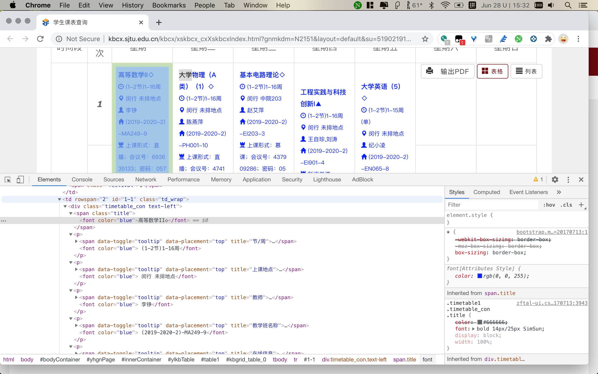

# SJTU_Classtable_grabber

如需访问排版更好的描述文档，请跳转到 [DESCRIPTION.md](DESCRIPTION.md)

 
本程序运行于Python3下。

测试环境：

    macOS 10.14.6 (18G5033)，Python 3.7.7 (default, Mar 10 2020, 15:43:03) [Clang 11.0.0 (clang-1100.0.33.17)] on darwin

  
### 设计起因：

Zoom手机客户端拥有从日历同步事件的功能，可是网上和app本身都找不到关于该功能的任何说明。

经过大量时间的探索和尝试，我发现将特定的zoom邀请链接随附于事件的NOTES区域即可让zoom手机客户端自动发现该会议并在将要到达会议时间时做出提醒。

我分析了链接中的规律，并本着简化每次上课时必要且繁琐的输入会议号和密码的操作，写了这版程序。

该代码近日已经在 [GitHub](https://github.com/VoidXia/SJTU_Classtable_grabber) 上开源，遵循MIT协议。日后会持续地做完善和更新。

  
## 程序大结构框架如下：

如需放大查看详情请参阅随附的 "[flowChart.pdf](flowChart.pdf)"

  

以下是**程序过程说明**：

## 引用库的顺序
必须先引用tkinter才能再引用PIL中的Image, ImageEnhance，若交换两者引用顺序，则会在验证码二值化的过程中返回

    AttributeError: type object 'Image' has no attribute 'open'

猜想是由于PIL中的image与tkinter中的image产生冲突所导致。

  
## 自动登录jAccount：

### 验证码获取并识别： **getCaptcha** LINE 51

查看网页元素可以发现，验证码获取过程中传入了一个唯一uuid

于是在获取验证码图片的过程中传入该页面对应的uuid和cookies 
    
    *LINE 73*
        cookies = chrome_driver.get_cookies()
        cookies = {i["name"]: i["value"] for i in cookies}
        uuid = chrome_driver.find_element_by_xpath(
            '//form/input[@name="uuid"]')
        params = {
            'uuid': uuid.get_attribute('value')
        }
    *LINE 53*
        response = requests.get(captcha_url, cookies=cookies, params=params)

为了提高验证码识别准确率，考虑首先将图像二值化后再进行识别。以下是图像二值化前和二值化后的对比：

使用pytesseract识别二值化后的图像验证码：

实际使用中二值化后的图像识别具有较高的准确率

尽管图像已经经过了二值化，但是仍然有极低的识别错误的可能，为了防止意外死循环，通过检测url内"*jaccount*"字段是否出现重复获取验证码进行识别

通过检测页面上id为**div_warn**的部分判断用户名密码是否错误，若错误则直接退出。

    Wrong username or password! Please check!

### 如何登录jAccount？

使用selenium模拟浏览器操作：

同样的，通过对应的id自动寻找到对应用户名密码验证码字段，填入，跳转到下一页面

    
### 需要使用chrome_driver:

判断操作系统，选择对应的驱动加载。在这里已经全部下载完成，程序自动选用。
    
  
## 如何提取课程表页面信息？

分析js渲染过后的审查元素：

发现每一个区隔都拥有class为td_wrap

于是以此为搜索条件，提取每一节课的信息

    LINE 109
    find_elements_by_css_selector('td.td_wrap') 
    

提取text部分得到的内容形如：

    ['基础日语(（Ⅲ）◇', '(9-10节)1-16周', '闵行', '未排地点', '外教J', '(2019-2020-2)-JA012-1', 'zoom直播,第三周开始开课（第二周试讲）,会议ID：489479578', ',会议密码:79589393', '理论:64', '4.0']

    ['高等数学II◇', '(3-4节)1-16周', '闵行', '未排地点', '李铮', '(2019-2020-2)-MA249-9', '上课形式：直播；会议号：693635133；密码：05750760；直播老师：李铮', '无', '4']

需要识别区分这两种形式，从不同位置提取会议室号和密码

利用正则表达式匹配所有数字

    LINE 131
    tmp2 = re.findall(r"\d+\.?\d*", tmp0[6])

分情况讨论。

 

创建列表：

    titles 储存课程名称，
    times 储存课程时间，
    clock 储存处理后的课程起始终止周数以及时间节点，
    zooms 储存课程会议号，
    pwds 储存会议密码，
    urls 储存整合后的zoomurl，
    days 记录每月的天数，
    timeh和timem 分别记录每节课的开始结束时间

从字段中找到并过滤**暂不开课**的课程

过滤单双周信息，星期几开课，课程开始结束事件，储存到clock列表中

  

## 创建日历事件类以及日历类
仿照导出的日历文件进行写入

需要注意的是：每个事件都必须拥有一个唯一的UID，这里使用课程名称和起始时间的组合，利用uuid5函数生成唯一的基于名字的 SHA-1 散列值，写入日历。

生成日历文件：2020-Spring{auto}.ics

  

## 函数复用

**drawWeek** 函数传入星期数和需要执行的函数名称**fun**，对所有课程进行判定，若该星期内有这门课，则将课程信息传入**fun**函数执行下一步操作
    
由于该程序需要同时执行绘制课表和创建日历的操作，这样的操作都使用了同一个函数 **drawWeek**，可以使得代码逻辑清晰，易于查找相关错误。

  

## 绘制课程表
使用tkinter的**Combobox**制作下拉菜单，让用户选择想要查看星期的课程表。

由于在每次生成课程表之前都将画布刷新，所以画布可以重复使用，直到用户查看完毕，关闭绘图窗口为止。

同样的，绘图窗口绘制的课程表也严格按照实际上课时间比例绘制，做了相应的计算和修正。
    
## 程序结束

若程序正常结束，自动打开生成的.ics文件导入日历系统。

若程序中断退出，则捕获错误，抛出异常信息，提示用户重试。

## 实现效果：

在课程开始前30分钟及课程开始时，Zoom与日历程序均提示，手机端日历自动与电脑端保持同步。

如图：

  
程序结构清晰，易于阅读。

